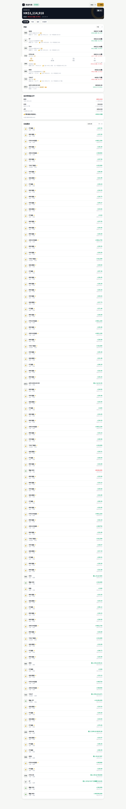
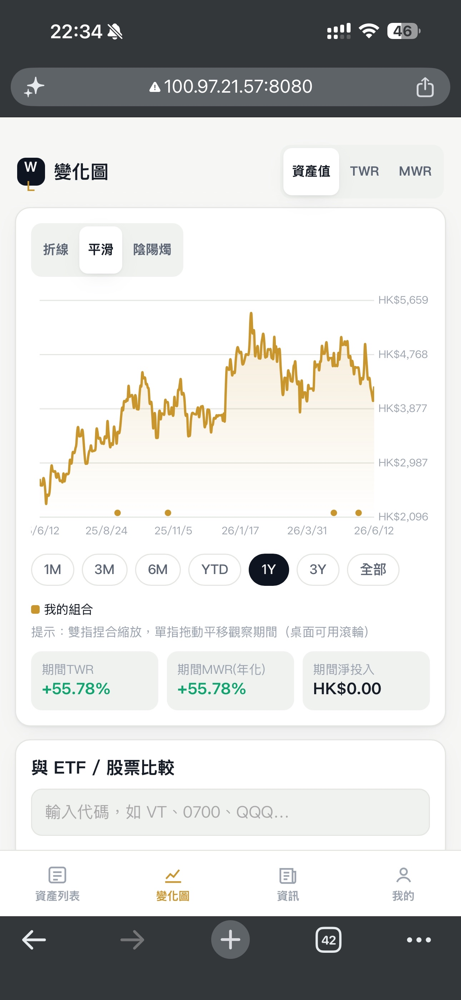
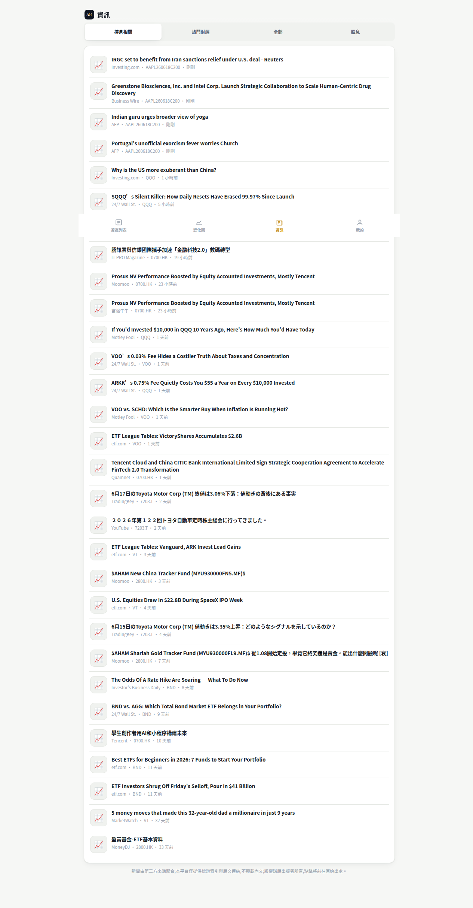
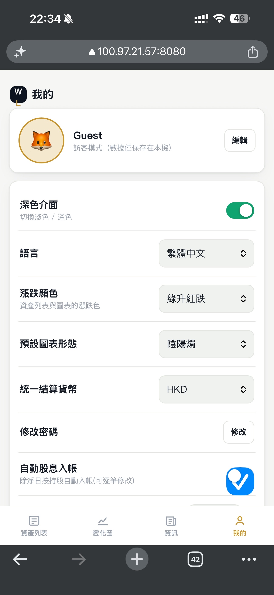

# WealthLens — Portfolio Management Platform

[中文](README.md) | **English**

WealthLens is a **mobile-first**, multilingual portfolio tracker built as a **single-file HTML frontend + zero-dependency Node.js backend**, focused on accurate cross-market, multi-currency accounting and performance analytics. It runs on an entry-level VPS, or offline via `file://`.

> ⚠️ **Disclaimer**: This is a personal finance tracking tool. All market data, FX rates and news come from third-party sources, are provided for reference only, and **do not constitute investment advice**. News is shown as headline indexing with links to the original publishers, who retain all copyright.

## Screenshots

| Asset List | Performance Chart |
|:---:|:---:|
|  |  |

| News | Profile |
|:---:|:---:|
|  |  |

## Highlights

- **Mobile-first**: ≥44dp touch targets, gesture-driven chart, bottom tab navigation; also works on tablet and desktop.
- **Multilingual**: Traditional Chinese, Simplified Chinese, English — instant switching (external JSON language packs with embedded fallback for offline use).
- **Multi-market & multi-currency**: US stocks/ETFs, HK, China A-shares, Japan, crypto; balances auto-converted to a base currency using historical FX.
- **Industry-standard accounting**: raw-price valuation + transaction restatement + internal cash transfers — correctly handles dividends, splits and fees, avoiding NAV distortion and double counting.
- **Resilient data layer**: multi-source fallback, local persistence + incremental updates, post-market prefetch, request coalescing, gzip.
- **Real account system**: scrypt password hashing, Bearer tokens, optional email verification, cloud portfolio sync.
- **Privacy & sharing**: one-tap privacy mode hides all amounts; share a returns-only (no amounts) performance card.
- **Zero dependencies**: backend uses only Node.js built-ins — no `npm install`.

## Feature Overview

### Asset List
- Holdings overview: market value, P/L, return %, dividends received, trailing-12-month dividend estimate.
- **Total card**: tap the amount to toggle privacy mode; tap the P/L below to cycle "total P/L / last-two-trading-day change"; the "Analysis" button opens the analysis page.
- **Sorting**: by value, daily change %, or return (asc/desc).
- **Tap amount to cycle**: latest market value → latest price (daily %) → daily value change.
- **Holding detail page**: tap any holding for latest price, mini sparkline, full transaction history for that asset, dividends, data source; delete the entire asset.
- **Multi-currency cash board**: per-currency balances (negatives/margin supported), cumulative dividend & interest income, cumulative fees & liabilities.
- **Transactions**: nine activity types (stock/bond/cash/option/other/dividend/interest/fee/liability) with a fee field.
- **Transaction filter**: grouped dropdown (by type / by symbol); filtering by symbol also includes that asset's related dividends.
- **Asset location**: distinguishes brokers/banks; a picker icon selects existing locations; blank defaults to "Default".

### Portfolio Analysis
- **Asset allocation**: pie chart of cash / stocks / bonds / other, with weights and amounts.
- **Overall performance**: portfolio TWR vs major indices (SPY, VT) over the same period.
- **Track investing gurus**: powered by US SEC EDGAR 13F public filings — shows the latest-quarter top-10 holdings (name / value / weight) of gurus such as Buffett, Burry, Ackman, Dalio, Tepper and Druckenmiller; clearly noting limitations (US long positions only, up to 45-day lag after quarter-end, no cash).

### Performance Chart
- Three metrics: NAV, TWR (time-weighted), MWR (money-weighted) — TWR and MWR share a cumulative basis and coincide when there are no external cash flows.
- Four chart types: line, smooth curve, candlestick (daily/weekly/monthly/yearly aggregation).
- **Gestures**: pinch-zoom, single-finger pan, long-press scrub (shows date + portfolio + every comparison series), lingering readout on release.
- **Benchmark comparison**: add any ETF/stock (e.g. VT, SPY) overlaid as a total-return (adjusted-price) curve.
- **Event markers**: ex-dividend (💰) and split (✂️) icons on the X-axis; crosshair reveals details.
- **Periods**: 1M / 3M / 6M / YTD / 1Y / 3Y / ALL, filterable by asset location.
- Options are excluded from the curve; the chart notes "excludes options value ±X".

### News
- Three tabs: holdings-related / trending / all.
- Smart relevance lookup by company or fund name (optimized for non-US tickers).
- **Shows only headline, source and time, linking to the original article** — no content reproduction.

### Profile
- Avatar & profile, change password, logout, **delete account** (password-confirmed, permanently removes all data; supports GDPR/PDPO right to erasure).
- Dark/light theme, language, up/down color preference, default chart type.
- **Privacy mode** toggle (on by default): hides all amounts (shown as •••); ratios and prices stay visible.
- **P/L display** default mode (total P/L / daily change).
- **Share return**: generate a returns-only card (no amounts), rendered to PNG via Canvas, saved to the photo album through the system share sheet or downloaded directly.
- **Auto-dividend** toggle and **dividend withholding tax** rate.
- **Custom data sources** (JSONPath), **CSV import/export**, demo portfolio load/clear.

## Accounting Model (Raw Price + Internal Cash Transfer)

- **Valuation**: personal portfolio always uses raw price (split-adjusted, dividend-unadjusted); benchmark comparison is the only place adjusted price (total return) is used.
- **Dividends**: auto-booked on the ex-date pro-rata by holdings per location; net = shares × per-share × (1 − tax). Auto entries are marked ⚡; editing converts to manual, deleting adds to a skip list; ±14-day de-dup per symbol. NAV stays smooth (price drops, cash rises) and it is not counted as external cash flow.
- **Splits**: transaction restatement (units × F, price ÷ F); the user's records are never rewritten and NAV/cost don't jump.
- **Options**: excluded from the curve and TWR/MWR; cash in/out treated as external flow (fully neutral); valued statically at the last settlement price.
- **Fees / liabilities**: internal expenses — reduce cash, not flows, naturally lowering returns.
- **TWR**: `∏ Vₜ/(Vₜ₋₁+Cₜ) − 1`, fees not double-counted; **MWR**: XIRR, in both cumulative and annualized bases.

## Data Architecture

- **Quote fallback chain**: Yahoo Finance → stale local store → Stooq (US/HK/JP). Crypto: Yahoo → CoinGecko.
- **FX fallback**: Yahoo `{CCY}=X` → local store → Frankfurter / ECB; cross rates via USD triangulation.
- **Persistence + incremental updates**: history stored in `data/market/`, served from store within 30 min, otherwise only the gap is fetched; full refetch only when a new split is detected.
- **Post-market prefetch**: daily at 05:00 Taipei (`PREFETCH_HOUR`), refreshing all holdings and custom sources.
- **Custom data sources**: feed any API via JSONPath (auto date detection, SSRF protection, repeated-failure alerts).
- **Pluggable news layer (auto-routed by market)**: **HK (.HK), China A-shares (.SS/.SZ) and Taiwan (.TW) tickers auto-query Google News in Chinese, Japan (.T) in Japanese, while US stays on Yahoo (English)** — all by company name — works with no configuration, attribution kept, no content reproduced. You can also set `NEWS_PROVIDER=rss` to force RSS for all, or `NEWS_PROVIDER=newsapi|marketaux` + `NEWS_API_KEY` for licensed sources. News is cached **per symbol** with request coalescing — each symbol is fetched at most once per cycle site-wide, regardless of user count.

## Project Structure

```
wealthlens/
├── server.js              # zero-dependency Node.js backend (>= Node 18)
├── public/
│   ├── index.html         # frontend (single file, all CSS/JS)
│   └── i18n/              # language packs zh-Hant / zh-Hans / en
├── test/                  # regression tests (engine + backend)
├── docs/screenshots/
├── package.json
├── README.md / README.en.md
├── DEPLOY.md              # VPS deployment guide
└── data/                  # auto-created at runtime: users, portfolios, market cache
```

## Quick Start

Requires **Node.js 18+** (built-in `fetch`). No `npm install` needed.

```bash
node server.js            # default http://localhost:8080
PORT=3000 node server.js  # custom port
```

Open `http://localhost:8080`. On first run, choose Guest mode and load the demo portfolio to explore instantly.

### Environment Variables

| Variable | Description | Default |
|---|---|---|
| `PORT` | server port | 8080 |
| `PREFETCH_HOUR` | daily prefetch hour (local time, -1 to disable) | 5 |
| `SMTP_HOST` / `SMTP_PORT` / `SMTP_USER` / `SMTP_PASS` / `SMTP_FROM` | enable email-verified signup (465 implicit TLS) | unset = no verification |
| `NEWS_PROVIDER` | news source: `rss` (Google News RSS, Chinese markets) / `newsapi` / `marketaux` | unset = Yahoo aggregation |
| `NEWS_API_KEY` | key for newsapi / marketaux (not needed for rss) | none |
| `MARKET_FRESH_MS` | freshness window for market data | 30 min |
| `SEC_UA` | SEC User-Agent for guru 13F lookups (use a real email) | built-in placeholder |

## Testing

```bash
npm test                  # engine (15) + backend (14) = 29 checks
```

Covers: ex-date NAV invariance, split restatement, option neutrality, fee handling, auto-dividends, cumulative MWR, quote fallback chain, incremental merge, JSONPath, CoinGecko, request coalescing, email verification.

## Deployment

A complete from-scratch VPS guide (reverse proxy + automatic HTTPS + backups + Cloudflare): see **[DEPLOY.md](DEPLOY.md)**.

An entry-level VPS (1 vCPU / 1GB RAM, ~US$4–6/mo) is sufficient. Fronting with Cloudflare's free tier is recommended for DDoS protection; the app layer also has per-IP rate limiting and slow-request timeouts.

## Capacity & Scale

- **Personal use**: ~30–100MB traffic/month, ~2–3MB storage; does not grow unbounded over time.
- **10,000 users**: total storage under ~3GB; upstream API calls scale with the number of distinct symbols, not users — with persistence, prefetch and coalescing, well within source tolerance.
- Beyond ~1,000–2,000 users, migrating users/sessions to SQLite (built into Node 22+) is recommended.

## Legal & Compliance

- Market data and news are obtained from third-party sources, intended primarily for **personal/demo use**. **Before commercial launch**, switch to properly licensed data and news APIs and consult a local lawyer.
- News is indexed as "headline + source + link" with redirection to the source — **no content is reproduced**; copyright belongs to the original publishers.

## Tech Stack

- Frontend: vanilla HTML/CSS/JavaScript, Canvas-drawn charts, no framework, no build step.
- Backend: Node.js built-ins (http / crypto / tls / zlib / fs), zero third-party dependencies.
- Storage: JSON files (atomic writes) + two-layer cache.

## Acknowledgements

Architecture inspired by two excellent open-source projects (concepts only, no code copied):
[Ghostfolio](https://github.com/ghostfolio/ghostfolio) (data-source abstraction, market-data persistence, activity types) and
[Portfolio Performance](https://github.com/portfolio-performance/portfolio) (TWR/MWR calculation, JSON Quote Feed, data-source lessons).

## Contact / Author

- Author: Capture
- Email: capturesir@gmail.com
- Issues & suggestions: reach out via the email above, or open an issue in the repository.

## License

MIT License — see [LICENSE](LICENSE).
