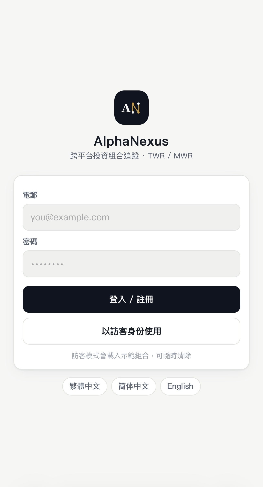
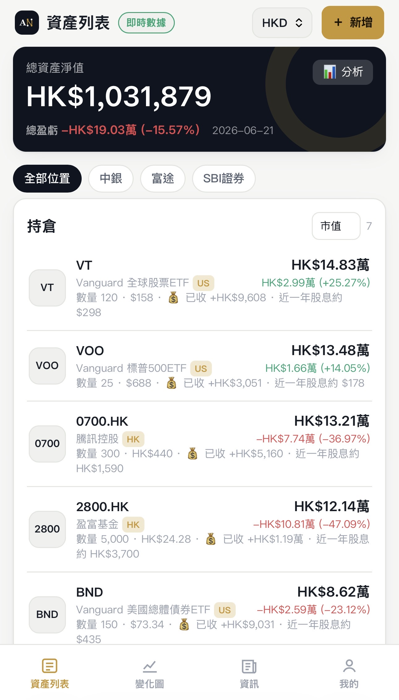
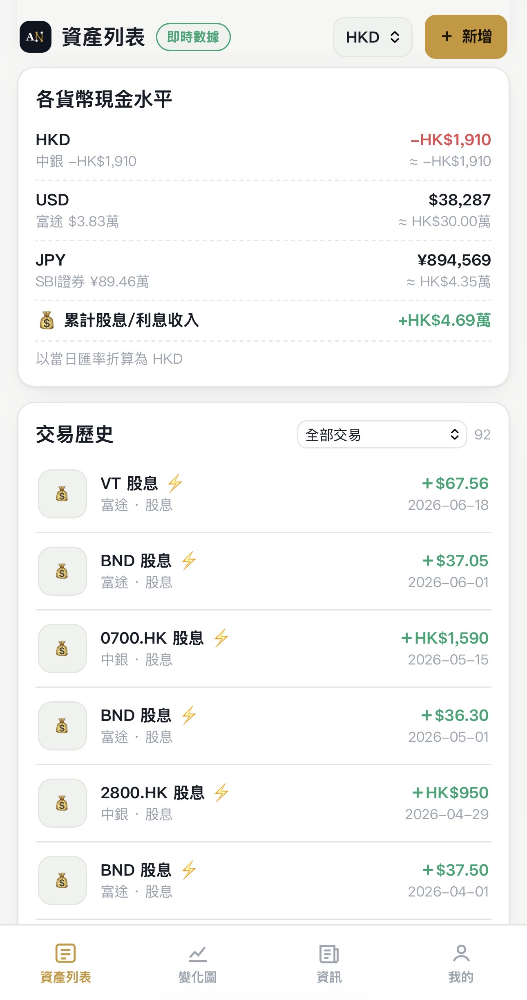
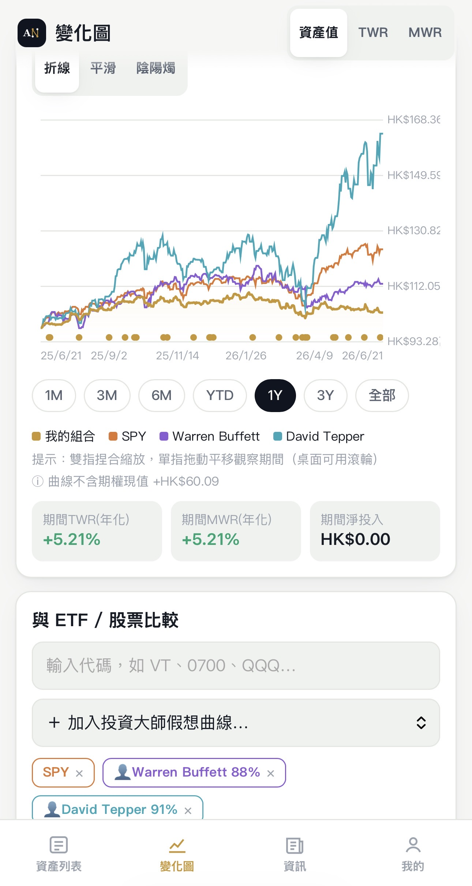
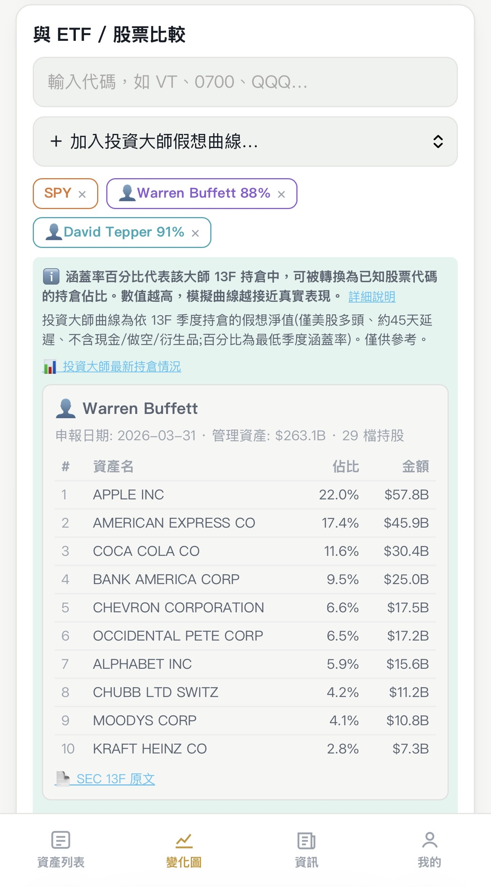
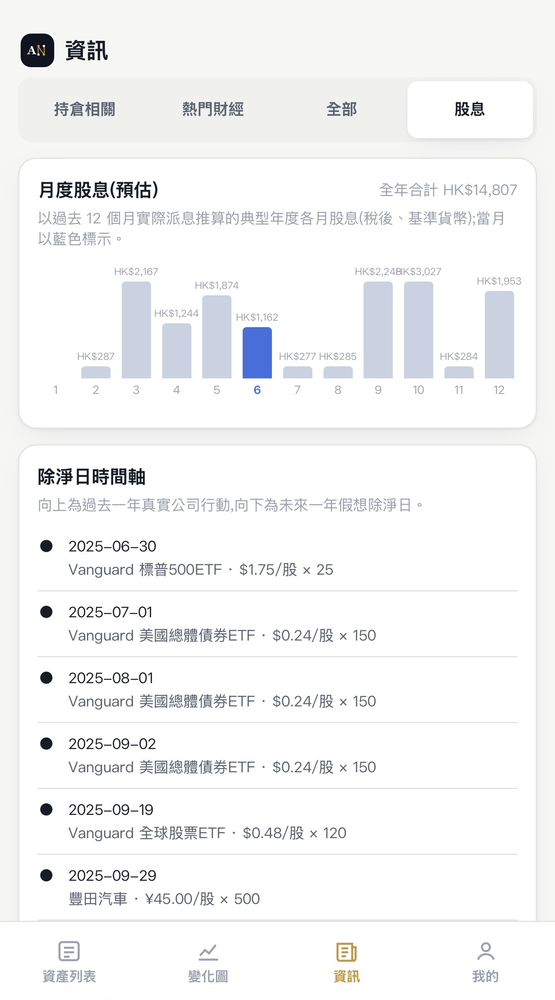
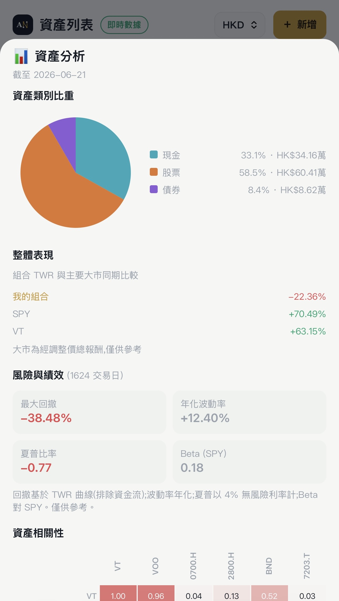
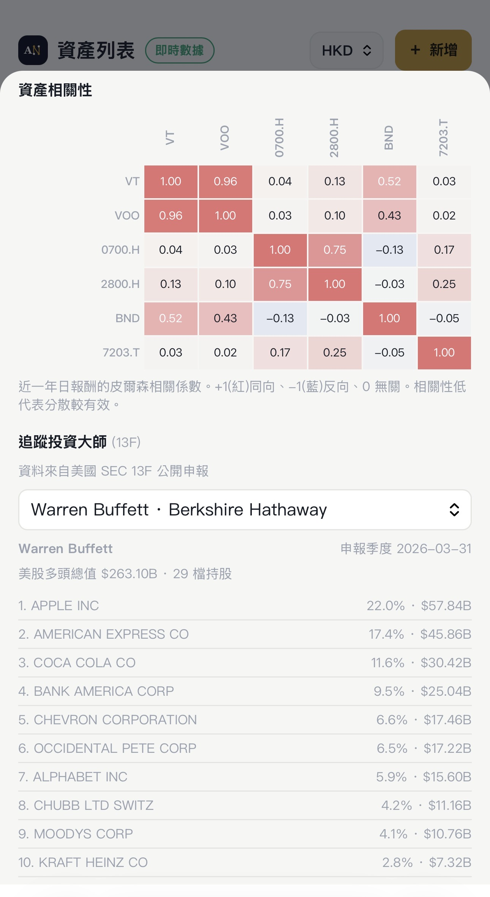
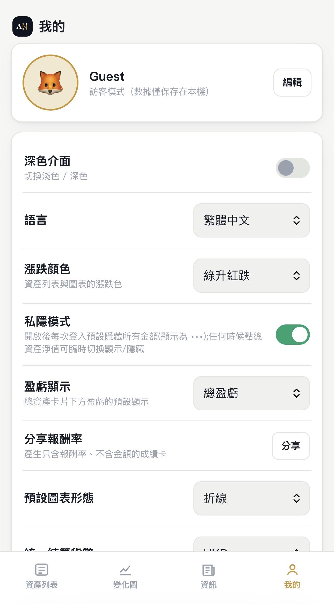
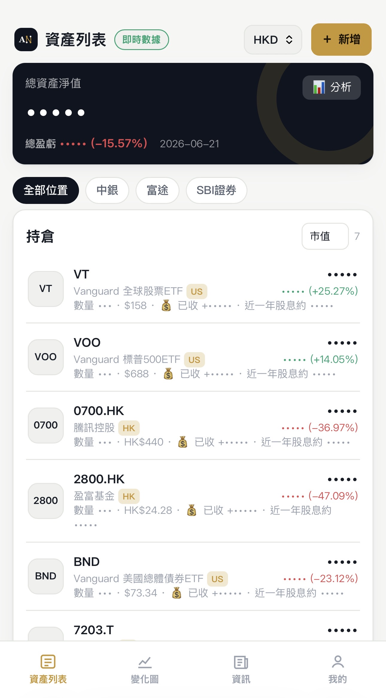

<div align="center">

# AlphaNexus

**ポートフォリオ管理プラットフォーム**


[中文](README.md) | [简体中文](README.zh-CN.md) | [English](README.en.md) | **日本語**

</div>

## システム画面

👉 [Live Demo で体験](https://www.alphanexus.cc) — ゲストモードで登録なしに利用可能。

|  |  |
|:---:|:---:|
|  |  |
|  |  |
|  |  |
|  |  |
|  |  |

---

**モバイルファースト**の多言語ポートフォリオ追跡プラットフォーム。単一HTMLフロントエンド + ゼロ依存Node.jsバックエンドで、クロスマーケット・多通貨の正確な会計処理とパフォーマンス分析に特化。最小構成のVPSで稼働し、`file://`でオフライン利用も可能。

> ⚠️ **免責事項**：本プラットフォームは個人の資産管理ツールです。市場データ、為替レート、ニュースはすべて第三者ソースからの情報であり、**いかなる投資助言を構成するものでもありません**。

---

## ✨ AlphaNexusの特長

<table>
<tr>
<td width="50%">

### 🏗️ ゼロ依存アーキテクチャ
バックエンドはNode.js標準モジュールのみ使用。`npm install`不要。`server.js`一つで完備——デプロイ、スケール、保守が極めてシンプル。

</td>
<td width="50%">

### 📱 モバイルファースト設計
44dp以上のタッチターゲット、ジェスチャーチャート、ボトムタブナビゲーション。スマホ・タブレット・PCに対応。

</td>
</tr>
<tr>
<td>

### 🌍 4言語即時切換
繁體中文、简体中文、English、日本語。外部JSON言語パック＋オフライン用組み込みフォールバック。

</td>
<td>

### 🔒 セキュアな認証
scryptパスワードハッシュ + Bearerトークン + メール認証オプション + ブルートフォース対策 + HSTSセキュリティヘッダー。

</td>
</tr>
</table>

---

## 🚀 主要機能

### 📊 精密会計エンジン

| 特長 | 説明 |
|:---|:---|
| **原価評価** | 分割調整済み、配当未調整——NAV歪みなし |
| **自動配当計上** | 権利落ち日に保有比率に応じて自動計上、税引後精確 |
| **分割再表示** | 取引単位数を自動調整、ユーザー記録は改変されない |
| **TWR / MWR** | 時間加重・金額加重(XIRR)二重指標、累積＋年率 |
| **9種の取引タイプ** | 株式/債券/現金/オプション/その他/配当/利息/費用/負債 |

### 🌐 クロスマーケット・多通貨

```
米国株/ETF  ·  香港  ·  A株  ·  日本株  ·  暗号通貨
           ↓ 歴史為替レート自動換算 ↓
          統一基準通貨表示
```

### 📈 チャート＆分析

- **4種のチャート**：折れ線、スムーズカーブ、ローソク足（日/週/月/年集約）
- **ジェスチャー操作**：ピンチズーム、パン、ロングプレスで数値スクラブ
- **12種のテクニカル指標**：SMA、EMA、RSI、MACD、ボリンジャーバンド、KD、VWAP、ATR、OBV、ADX、パラボリックSAR、一目均衡表
- **ベンチマーク比較**：任意のETF/株式（SPY、VT等）のトータルリターン曲線を重ね合わせ
- **イベントマーカー**：権利落ち日 💰、分割 ✂️ をチャートX軸に表示

### 🧠 投資の巨匠を追跡

米国SEC EDGAR 13F公開情報に基づき、**13人の巨匠**の四半期保有変動を追跡：

| 巨匠 | 組織 | 巨匠 | 組織 |
|:---:|:---:|:---:|:---:|
| バフェット | Berkshire | Dalio | Bridgewater |
| 李录 | Himalaya | Loeb | Third Point |
| Tepper | Appaloosa | Klarman | Baupost |
| Ackman | Pershing | Burry | Scion |
| Druckenmiller | Duquesne | Griffin | Citadel |
| Cohen | Point72 | Coleman | Tiger Global |
| Wood | ARK | | |

- CUSIP自動解決（OpenFIGI API）
- 巨匠NAV曲線オーバーレイ比較
- 四半期保有差分分析（増加/減少/新規/決済）

### 💰 配当カレンダー

- 月次配当予測（過去12ヶ月の実績ベース）
- 権利落ち日タイムライン：上＝過去の実績、下＝将来の想定
- 保有銘柄のみ表示

### 📰 スマートニュース

- マーケット別自動ルーティング：香港/A株→中国語、日本株→日本語、米国→英語
- 見出し・ソース・時刻のみ表示——原文へのリンク、コンテンツ転載なし

### 🔐 プライバシー＆シェア

- **ワンタッププライバシーモード**：全金額を非表示（•••表示）、比率と株価は通常表示
- **リターンカード共有**：金額なしの成績カード、CanvasでPNG出力

---

## ⚡ クイックスタート

**Node.js 18+**（標準搭載の`fetch`）が必要。`npm install`不要。

```bash
git clone https://github.com/capturesir/alphanexus.git
cd alphanexus
node server.js
# → http://localhost:8080
```

初回起動時に「ゲストモード」を選択し、デモポートフォリオを読み込んで体験可能。巨匠データは初回起動時に自動構築（約10〜15分）、以降は四半期ごとに自動更新。

### 環境変数

| 変数 | 説明 | デフォルト |
|---|---|---|
| `PORT` | サーバーポート | 8080 |
| `CORS_ORIGIN` | 許可するフロントエンドオリジン（カンマ区切り） | 空＝全て許可 |
| | ⚠️ 本番環境では必ず設定（例: `https://www.alphanexus.cc`）。外部サイトからのAPI呼び出しを防止 |
| `SMTP_*` | メール認証（HOST/PORT/USER/PASS/FROM） | 未設定＝認証なし |
| `NEWS_PROVIDER` | ニュースソース：`rss` / `newsapi` / `marketaux` | Yahoo集約 |
| `PREFETCH_HOUR` | 毎日プリフェッチ時刻（-1で無効） | 5 |

---

## 🧪 テスト

```bash
npm test    # エンジン101 + バックエンド57 = 158項目 ✓
```

カバー範囲：権利落ち日NAV不変性、分割再表示、オプション中立性、費用処理、自動配当、MWR、クオートフォールバックチェーン、増分マージ、JSONPath、CoinGecko、CUSIPマッピング。

---

## 🏗️ 技術スタック

| レイヤー | 技術 |
|:---|:---|
| フロントエンド | バニラHTML/CSS/JS、Canvas描画チャート、フレームワークなし、ビルドステップなし |
| バックエンド | Node.js標準モジュール（http/crypto/tls/zlib/fs）、サードパーティ依存ゼロ |
| ストレージ | JSONファイル（アトミックライト）＋二層キャッシュ（メモリ＋ディスク） |
| データソース | Yahoo Finance → Stooq → CoinGeckoフォールバックチェーン |
| セキュリティ | scrypt、Bearerトークン、HSTS、X-Frame-Options、レート制限 |

---

## 📦 デプロイ

最小構成VPS（1 vCPU / 1GB RAM、月額〜US$4–6）で稼働可能。

```bash
# VPS上で
git clone https://github.com/capturesir/alphanexus.git
cd alphanexus
pm2 start server.js --name alphanexus   # 初回起動時に巨匠データを自動構築
pm2 save
```

Cloudflare無料プランでのDDoS対策を推奨。詳細ガイドはDEPLOY.md（ローカル専用、gitには含めない）。

---

## 📁 プロジェクト構成

```
alphanexus/
├── server.js          # ゼロ依存Node.jsバックエンド（〜1500行）
├── public/
│   ├── index.html     # シングルファイルフロントエンド（全CSS/JS）
│   └── i18n/          # 言語パック zh-Hant / zh-Hans / en / ja
├── test/              # リグレッションテスト（エンジン＋バックエンド）
├── package.json
└── data/              # 実行時に自動生成（gitに含めない）
```

---

## 📜 ライセンス

[PolyForm Noncommercial License 1.0.0](LICENSE) — 非商用無料オープンソース。商用利用には作者の許可が必要。

## ✉️ 連絡先

- 作者：Capture
- Email：capturesir@gmail.com
- 問題報告：issueまたはメールでお気軽に

---

<div align="center">

**アーキテクチャ参考**：[Ghostfolio](https://github.com/ghostfolio/ghostfolio) · [Portfolio Performance](https://github.com/portfolio-performance/portfolio)

</div>
